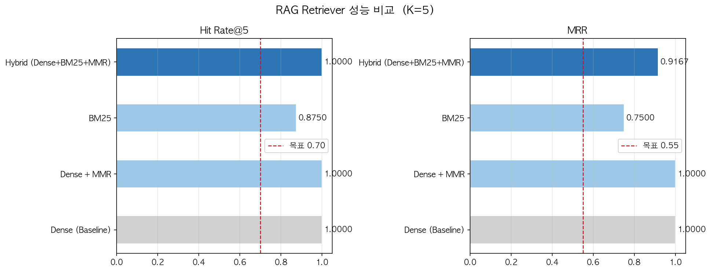
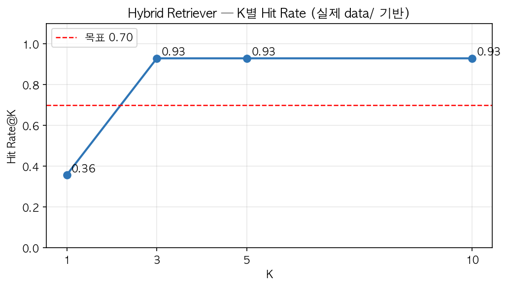

# Tech Strategy Agent

LangGraph 기반 멀티 에이전트 시스템으로 반도체·HBM 분야 경쟁사 기술 동향을 자동 수집·분석하여 TRL 기반 전략 보고서(PDF)를 생성합니다.

## Overview

- **Objective** : 공개 간접 지표(특허·학회·채용·공급 발표) 기반 경쟁사 TRL 추정 및 R&D 우선순위 관점의 전략 시사점 도출
- **Method** : Hybrid RAG + 웹 검색 병렬 수집 → Supervisor Reflection 루프로 품질 검토 → 승인 후 PDF 보고서 출력
- **Tools** : LangGraph, LangChain, ChromaDB, Tavily Search, LangSmith, WeasyPrint

## Features

- **TRL 기반 기술 성숙도 분석** : NASA 9단계 TRL 척도로 경쟁사별 기술 위치 정량 추정
- **TRL 4~6 한계 고지** : 핵심 영업 비밀 구간은 간접 지표 기반 추정임을 명시하여 보고서 신뢰성 확보
- **Dense MMR 검색** : 평가 결과 Hit Rate@5 0.93 / MRR 0.73으로 최고 성능 — BM25 대비 의미 검색이 기술 PDF 코퍼스에 효과적
- **확증 편향 방지 전략** : 웹 검색 쿼리를 positive / negative / indicator 3종으로 분리 생성, 동일 도메인 2건 초과 수집 제한
- **Supervisor Reflection 루프** : 완결성·근거성·규정 준수·균형성·전략성 5개 기준 자동 검토 및 재작성 지시
- **PDF 보고서 출력** : Markdown → HTML → PDF 자동 변환 (A4, 페이지 번호 포함)

## Tech Stack

| Category    | Details                                                      |
|-------------|--------------------------------------------------------------|
| Framework   | LangGraph, LangChain, Python                                 |
| LLM         | GPT-4o (Draft · Supervisor), GPT-4o-mini (Intent) via OpenAI API |
| Retrieval   | ChromaDB **Dense + MMR** (Hit Rate@5: 0.93, MRR: 0.73)             |
| Embedding   | BAAI/bge-m3 via sentence-transformers                        |
| Web Search  | Tavily Search API                                            |
| Observability | LangSmith                                                  |

## RAG Evaluation

평가 방식: ChromaDB 실제 청크 샘플링 → GPT-4o-mini QA 쌍 자동 생성 (14쌍) → 전체 코퍼스 검색 후 원본 청크 회수 여부 측정
목표: Hit Rate@5 ≥ 0.70 / MRR ≥ 0.55

| Retriever | Hit Rate@5 | MRR |
|-----------|:----------:|:---:|
| Dense (Baseline) | 0.93 | 0.71 |
| Dense + MMR | 0.93 | 0.73 |
| BM25 | 0.29 | 0.25 |
| Hybrid (Dense+BM25+MMR) | 0.93 | 0.67 |
| **Dense + MMR (최종 선정)** | **0.93** | **0.73** |

> BM25는 수식·표·영문 약어가 많은 기술 PDF 특성상 Hit Rate@5 0.29로 저성능. Hybrid 구성 시 BM25가 Dense MMR의 MRR(0.73)을 0.67로 끌어내려 오히려 역효과. 해당 코퍼스에서는 의미 기반 검색(Dense MMR)이 최적으로 판단되어 최종 선정.




## Agents

- **Intent Agent** : 사용자 자연어 요청에서 키워드·기업·분석 깊이·기간 범위 파싱
- **RAG Agent** : 키워드 × 기업 조합 다중 쿼리로 내부 벡터 DB 검색 (Dense + MMR)
- **Web Search Agent** : Tavily로 긍정·반론·간접 지표 쿼리 병렬 실행, 편향 필터링 적용
- **Draft Agent** : RAG·웹 결과 및 Supervisor 피드백을 반영하여 TRL 분석 보고서 초안 작성
- **Supervisor Agent** : 5개 기준으로 초안 검토 후 승인 또는 재작성 지시 (Reflection 루프)
- **Formatting Agent** : 승인 초안에 메타 헤더 추가 후 PDF 변환

## Architecture


## Directory Structure

```
tech-strategy-agent/
├── data/                  # 분석 대상 PDF 문서
├── agents/
│   ├── intent.py          # 요청 파싱
│   ├── rag.py             # Hybrid RAG 검색
│   ├── web_search.py      # 웹 검색 + 편향 필터링
│   ├── draft.py           # 보고서 초안 작성
│   ├── supervisor.py      # 품질 검토 및 승인
│   └── formatting.py      # PDF 변환
├── graph/
│   ├── state.py           # AgentState 정의
│   ├── graph.py           # 그래프 구성
│   └── edges.py           # 조건부 라우팅
├── main.py                # 실행 진입점 (data/ 자동 동기화 포함)
├── ingest.py              # ChromaDB 문서 적재
├── rag_evaluation.py      # Retrieval 성능 평가
├── .env.example           # 환경 변수 템플릿
└── requirements.txt
```

## Getting Started

```bash
# 1. 의존성 설치
pip install -r requirements.txt

# 2. 환경 변수 설정
cp .env.example .env
# .env 에 OPENAI_API_KEY, TAVILY_API_KEY 입력

# 3. data/ 에 PDF 문서 추가 후 실행 (자동 동기화)
python main.py

# 4. 커스텀 요청
python main.py --request "삼성전자, SK하이닉스 HBM4 TRL 분석"
```

## Contributors
- 김동우 : 프롬프트 엔지니어링, 웹 서치 노드 구성, PDF 리포트 디자인
- 박병주 : RAG 파이프라인 구축, Agent 아키텍처 구축, RAG 평가
